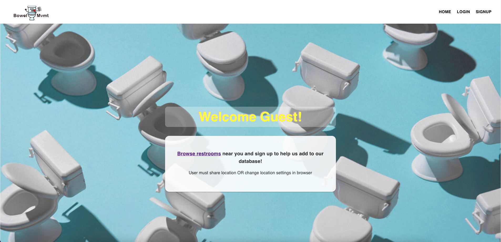
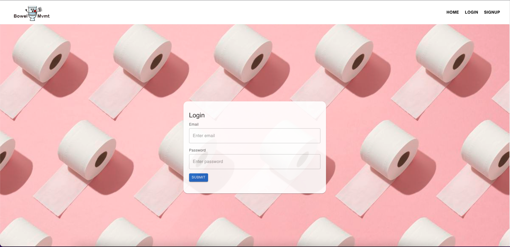
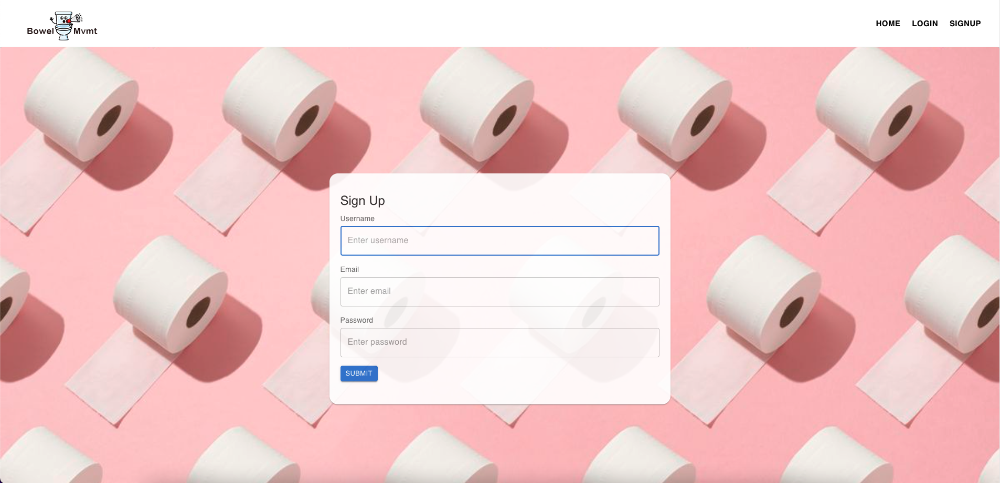
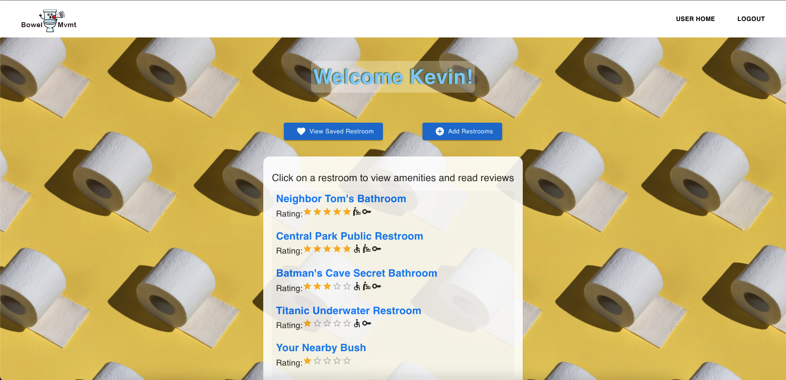
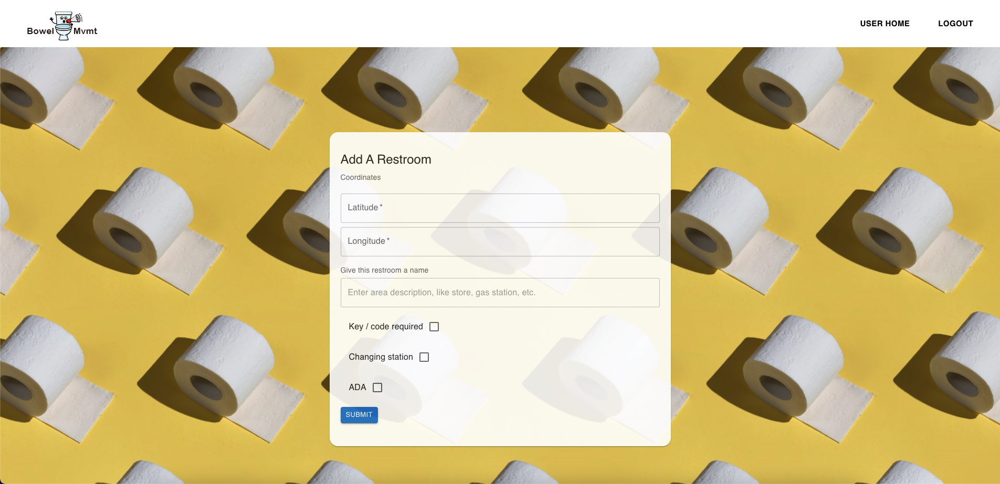
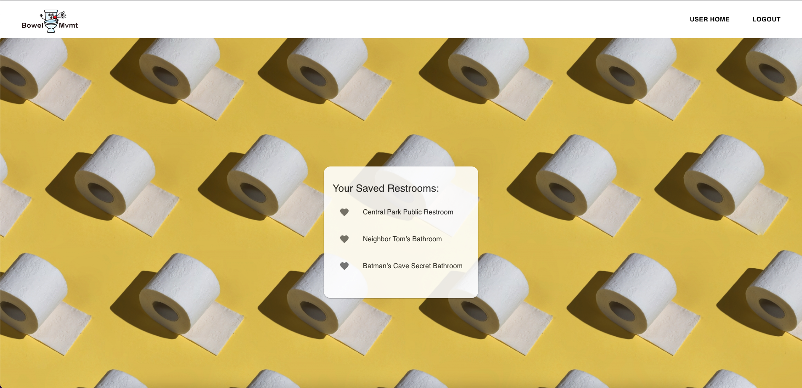
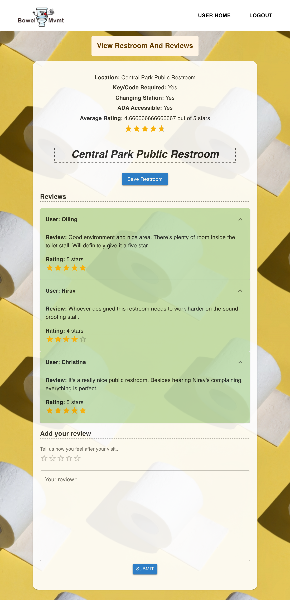

# THE-BOWEL-MVMT

## Description

The Bowel Mvmt is an app for users who need to use the restroom but don't know where to find one nearby. By using the app, users will be asked to give permission to the app for their current location. Once allowed, the landing page will then generate a list of nearby restroom with average rating and some icons next to the restroom name. Icons include whether key/code is required to access, changing station is available, and if it is up to ADA standard. Users can read reviews and leave their own by loging in or signing up. If users enjoyed their short stay and would like to visit again, they can simply tap on the save button and the restroom will be added to their collection. Users not only can save restroom they loved, but can also add restroom that is not listed into our database.

## User Story

As a person who needs to find a public restroom urgently, I want to know information about that restroom’s cleanliness and amenities beforehand, so that I know whether to stop or save time and drive to the next one.

As a person who likes to know about all restrooms that are readily available near me, I want to be able to add new ones I come across or see new ones that other users have added, so that I can find restrooms that aren’t listed on Google Maps

## Acceptance Criteria

Given an application that helps to find public restroom  
WHEN user visits the home page,  
THEN user can click link to see nearby restrooms in a specified radius by allowing access to their location via an alert window  
WHEN user is looking at the list of nearby restrooms,  
THEN user can navigate to login or sign-up popup by clicking on either link in Navbar to create an account or log in with existing account  
WHEN user signup a new account  
THEN user needs to provide username, email, and password  
WHEN user login to the account,  
THEN user will see a list of restrooms nearby and a button to add new restroom at the top right corner, a button to view saved restrooms, and a log out button on the bottom of the page  
WHEN viewing the list of restrooms,  
THEN user can select one and view amenities/ reviews  
WHEN user views a selected restroom  
THEN they can continue to add a review, save the restroom, or go back to userpage OR logout  
WHEN the user clicks the save button,  
THEN the restroom gets added to their saved restrooms list  
WHEN user selects add review button,  
THEN a new popup form will be displayed, and user can select how many stars restroom should have, fill out a description/comments for additional details about the restroom and add pictures as a url  
WHEN user clicks on add new restroom button,  
THEN user will be redirected to a new page to add description, fill out the checkboxes with the following options: [key required, toilet paper available, diaper changing station, working flush, disabled person friendly], and add coordinates/location of the restroom  
WHEN user clicks submit button,  
THEN user will be redirected back to the view restroom list page

#

# Technologies Used

## React UI Components Library

- React
- Material UI

## Database/Models

- MongoDB
- GraphQL API
- Node.js
- Express.js

#

# Deployed Application

[Heroku](https://the-bowel-mvmt.herokuapp.com/)

#

## Homepage

## Nearby Restroom List Page (not yet login)

.png>)

## Login Page

## Sign Up Page

## User Page

## Add A Restroom Page

## Saved Restroom Page

## Restroom With View/Add Reviews Page

#

© 2022 IPee Addresses: [Nirav Venkatesan](https://github.com/nirav-v), [Qiling Deng](https://github.com/qd9069), [Christina Christiansen](https://github.com/christinaa126), [Kevin Wang](https://github.com/ohdeer31)
